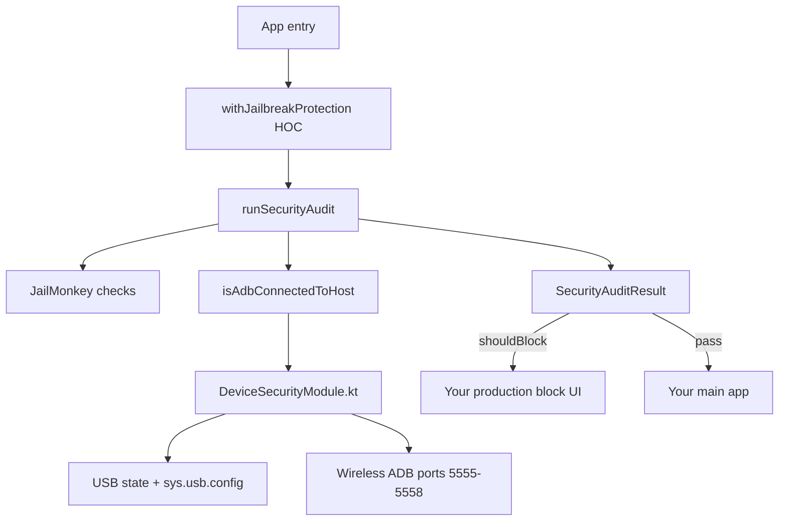

# Security & ADB Detection — Production Migration Guide

Use this document to port jailbreak/root detection and **active ADB connection** blocking from this demo into your production React Native app. **UI is yours** — only copy the logic, native module, and patch described below.

---

## What you get

| Capability | How |
|------------|-----|
| Jailbreak (iOS) | `jail-monkey` `isJailBroken()` |
| Root / Magisk / SU (Android) | `jail-monkey` `rootedDetectionMethods()` (requires patch on 3.0.0) |
| Hook / tamper apps (Android) | `jail-monkey` `hookDetected()` |
| External storage (Android) | `jail-monkey` `isOnExternalStorage()` |
| **Active ADB to host** (Android) | Custom `DeviceSecurityModule` (USB + wireless) |

**Block rule:** total finding score ≥ `100` → block app.

**ADB rule:** block only when the device is **actively connected** to a computer (USB or wireless ADB), not when USB debugging is merely enabled in Settings.

**After user fixes settings:** they must **kill the app and reopen** (fresh audit on mount). No live “unblock” on the block screen.

---

## Architecture



---

## Files to copy (demo → production)

### Required — JavaScript / TypeScript

| Source (this repo) | Destination (production) | Notes |
|--------------------|--------------------------|-------|
| `src/security/runSecurityAudit.ts` | e.g. `src/security/runSecurityAudit.ts` | Scoring + all jail-monkey calls. Adjust labels/scores if needed. |
| `src/security/isAdbConnectedToHost.ts` | same path pattern | Bridge to native module. |
| `src/security/withJailbreakProtection.tsx` | same | **Replace** `SecurityBlockScreen` with your UI (see below). |

### Required — Android native

| Source | Destination | Notes |
|--------|-------------|-------|
| `android/.../security/DeviceSecurityModule.kt` | `android/app/src/main/java/<your.package>/security/` | Change `package` line to your app id. |
| `android/.../security/DeviceSecurityPackage.kt` | same folder | Register in `MainApplication`. |

### Required — jail-monkey patch

| Source | Destination |
|--------|-------------|
| `patches/jail-monkey+3.0.0.patch` | `patches/jail-monkey+3.0.0.patch` (repo root) |

### Optional — tests

| Source | Use |
|--------|-----|
| `__tests__/runSecurityAudit.test.ts` | Adapt mocks to your app |
| `__tests__/isAdbConnectedToHost.test.ts` | Bridge tests |
| `__tests__/withJailbreakProtection.test.tsx` | HOC behavior |

### Do **not** copy (use your own UI)

- `src/components/SecurityBlockScreen.tsx`
- Demo navigation / auth screens

---

## 1. Dependencies

```bash
npm install jail-monkey@^3.0.0
npm install --save-dev patch-package
```

**Important:** Use **jail-monkey 3.0.0+** if `newArchEnabled=true` in `android/gradle.properties`. Version **2.8.x is Old Architecture only** and will not link with New Architecture.

Add to `package.json`:

```json
{
  "scripts": {
    "postinstall": "patch-package"
  }
}
```

Copy `patches/jail-monkey+3.0.0.patch` from this repo, then:

```bash
npm install
# Should print: jail-monkey@3.0.0 ✔
```

### Why the patch is mandatory

On jail-monkey **3.0.0**, `rootedDetectionMethods()` crashes with `ClassCastException` (nested `rootBeer` map cast to `Boolean`). Without the patch, root checks are skipped (or the whole audit failed before we added `safeCall`).

**Do not remove** `safeCall` / try-catch around `rootedDetectionMethods` in `runSecurityAudit.ts` even with the patch — defense in depth if `postinstall` is skipped in CI.

---

## 2. Android native module

### 2.1 Copy Kotlin files

1. Copy `DeviceSecurityModule.kt` and `DeviceSecurityPackage.kt`.
2. Set the package to match your app, e.g. `package com.yourcompany.yourapp.security`.
3. Keep module name **`DeviceSecurityModule`** (JS looks up `NativeModules.DeviceSecurityModule`).

### 2.2 Register package

In `MainApplication.kt` (or equivalent):

```kotlin
import com.yourcompany.yourapp.security.DeviceSecurityPackage

// Inside PackageList(...).packages.apply { ... }
add(DeviceSecurityPackage())
```

### 2.3 Rebuild

Native changes require a full rebuild — Metro reload is not enough:

```bash
cd android && ./gradlew assembleRelease
# or
npm run android -- --mode release
```

### 2.4 Native API surface

| Method / event | Type | Purpose |
|----------------|------|---------|
| `isAdbConnectedToHost()` | `Promise<boolean>` | Main check used by audit |
| `getAdbConnectionDiagnostics()` | `Promise<object>` | Debug only (`__DEV__` logs in JS) |
| `AdbConnectionChanged` | event `{ connected: boolean }` | Re-run audit when connection changes |

---

## 3. ADB detection logic (DeviceSecurityModule)

Evaluation order — **all must pass** for `connected === true`:

```
1. Developer Options ON     (Settings.Global.DEVELOPMENT_SETTINGS_ENABLED)
2. USB debugging OR wireless debugging enabled in Settings
3. Active path:
   USB:    cable connected + configured + sys.usb.config/state contains "adb"
   OR
   Wireless: wireless ADB on + adbd running + ESTABLISHED TCP on ports 5555–5558 only
```

**Intentionally excluded** (reduces false positives):

- `JailMonkey.AdbEnabled()` alone (setting on, no host)
- Generic established TCP on any port
- Stale sticky USB broadcast without using the incoming `Intent` from the receiver

**Wireless:** reads `/proc/net/tcp` and `/proc/net/tcp6` for local ports `15B3`–`15B6` (5555–5558 hex).

**Settings observer:** watches `ADB_ENABLED`, `adb_wifi_enabled`, `DEVELOPMENT_SETTINGS_ENABLED` and emits `AdbConnectionChanged` when they change.

---

## 4. JavaScript audit & scoring

### 4.1 `runSecurityAudit.ts`

Exports:

```ts
export const SECURITY_BLOCK_THRESHOLD = 100;

export type SecurityFinding = { id: string; label: string; score: number };
export type SecurityAuditResult = {
  score: number;
  findings: SecurityFinding[];
  shouldBlock: boolean;
};

export async function runSecurityAudit(): Promise<SecurityAuditResult>;
```

### 4.2 Scoring table (customize in production)

| Finding id | Condition | Score |
|------------|-----------|-------|
| `ios-jailbroken` | iOS jailbroken | 100 |
| `android-jailmonkey-rooted` | jail-monkey root check | 100 |
| `android-rootbeer-checkForSuBinary` | SU binary | 50 |
| `android-rootbeer-checkForMagiskBinary` | Magisk | 50 |
| `android-rootbeer-detectRootManagementApps` | Root apps | 50 |
| Weak RootBeer checks (6 types) | props, RW paths, test keys, etc. | 20 each |
| `hook-detected` | Hook/tamper apps | 60 |
| `external-storage` | App on SD card | 25 |
| **`adb-connected`** | **Active ADB to host** | **100** |

Two strong root findings (50 + 50) also reach 100. Tune scores/labels for your risk policy.

### 4.3 Fault tolerance

- Each jail-monkey call wrapped in `safeCall()` — one failure does not kill the audit.
- Sections run in isolation (`ios` / `android-rootbeer` / `android-adb` / `cross-platform`).
- HOC **fails open** on fatal audit error (score 0, no block) — logs `[SecurityAudit] fatal error`.

---

## 5. Integrate in production (logic only, your UI)

### 5.1 Minimal HOC pattern

Copy `withJailbreakProtection.tsx` and replace the block UI branch:

```tsx
import { runSecurityAudit, type SecurityAuditResult } from './runSecurityAudit';
import { subscribeToAdbConnectionChanges } from './isAdbConnectedToHost';

// Inside your HOC, when auditResult.shouldBlock:
if (auditResult.shouldBlock) {
  return (
    <YourProductionSecurityScreen
      findings={auditResult.findings}
      onDismiss={() => BackHandler.exitApp()}
    />
  );
}
```

Your screen only needs:

- `findings: SecurityFinding[]` — show `finding.label` (and optionally `finding.id` for analytics)
- Dismiss → `BackHandler.exitApp()` (or your policy)

### 5.2 Wrap app root

```tsx
// App.tsx (production)
function App() {
  return <YourRootNavigator />;
}

export default withJailbreakProtection(App);
```

### 5.3 Alternative: hook (no HOC)

If you prefer a screen gate inside navigation:

```tsx
const [audit, setAudit] = useState<SecurityAuditResult | null>(null);

useEffect(() => {
  runSecurityAudit().then(setAudit);
  const unsub = subscribeToAdbConnectionChanges(() => {
    runSecurityAudit().then(setAudit);
  });
  return unsub;
}, []);

if (audit?.shouldBlock) return <YourProductionSecurityScreen findings={audit.findings} />;
```

Same lifecycle: audit on mount, on `AppState` `'active'`, and on `AdbConnectionChanged`.

---

## 6. App entry wiring (reference)

Demo:

```tsx
// App.tsx
export default withJailbreakProtection(App);
```

Production: same pattern; keep your providers/navigation inside the wrapped component.

---

## 7. Verification checklist

Run on a **release** build on a physical device.

| # | Setup | Expected |
|---|--------|----------|
| 1 | Dev options OFF, no cable | App usable, no block |
| 2 | Dev options ON, USB debugging ON, **no cable** | App usable (setting alone does not block) |
| 3 | Dev options ON, USB debugging ON, **cable connected**, authorize RSA | Block; finding `adb-connected` |
| 4 | Unplug cable, kill app, reopen | App usable |
| 5 | Wireless debugging + paired + active session | Block when `wirelessPath` true in diagnostics |
| 6 | Rooted device (if you test root) | Block when score ≥ 100 from root findings |

### Debug logcat

```bash
adb logcat | grep -E 'SecurityAudit|DeviceSecurity'
```

- After patch: **no** `rootedDetectionMethods threw`
- In `__DEV__`: `[DeviceSecurity] ADB connection check` with `diagnostics` object

### Diagnostics (dev)

```ts
import { getAdbConnectionDiagnostics } from './isAdbConnectedToHost';

const d = await getAdbConnectionDiagnostics();
// d.connected, d.usbPath, d.wirelessPath, d.devOptionsEnabled, ...
```

---

## 8. Production customization checklist

- [ ] Replace block screen with production design (keep `findings` contract)
- [ ] Adjust `SECURITY_BLOCK_THRESHOLD` and per-finding scores in `runSecurityAudit.ts`
- [ ] Localize `label` strings (or map `finding.id` → i18n keys)
- [ ] Rename Kotlin package + register `DeviceSecurityPackage`
- [ ] Confirm `jail-monkey@3.0.0` + `patches/jail-monkey+3.0.0.patch` + `postinstall`
- [ ] CI runs `npm install` (so patch applies)
- [ ] Full native rebuild for release APK/AAB
- [ ] Decide: block on `hook-detected` (60) alone or require 100 — current config does **not** block at 60 alone

---

## 9. Known limitations

| Topic | Detail |
|-------|--------|
| iOS ADB | No custom module; iOS uses jail-monkey only |
| Emulator | Often flagged as rooted — bypass in dev if needed |
| OEM USB | Some devices report USB state differently; diagnostics help triage |
| Wireless ADB | Port scan is heuristic (5555–5558); unusual ports may be missed |
| `SystemProperties` | Reflection may be restricted on some builds |
| jail-monkey upgrade | If you bump past 3.0.0, re-test patch; filename is version-pinned |

---

## 10. Troubleshooting

| Symptom | Likely cause | Fix |
|---------|----------------|-----|
| "Security check could not be completed" (old builds) | jail-monkey crash + fail-closed HOC | Apply patch + fail-open HOC (this repo) |
| Blocked with debugging on, no cable | Using `AdbEnabled()` only | Use `isAdbConnectedToHost()` only |
| Still blocked after unplug | Stale state / no kill-reopen | Kill app and reopen; check diagnostics |
| Root checks never run | Patch not applied | `npm install`, verify `patches/` + postinstall |
| `NativeModules.DeviceSecurityModule` undefined | Package not registered | `DeviceSecurityPackage` in `MainApplication` + rebuild |

---

## 11. Quick copy command reference

From this demo repo root:

```bash
# JS security core
cp src/security/runSecurityAudit.ts      <PROD>/src/security/
cp src/security/isAdbConnectedToHost.ts  <PROD>/src/security/
cp src/security/withJailbreakProtection.tsx <PROD>/src/security/  # then swap UI

# Android native (adjust package name after copy)
cp android/app/src/main/java/com/adbconnectdemo/security/*.kt \
   <PROD>/android/app/src/main/java/<your/package>/security/

# jail-monkey patch
mkdir -p <PROD>/patches
cp patches/jail-monkey+3.0.0.patch <PROD>/patches/
```

Then add dependencies, `postinstall`, register native package, wrap `App`, and ship your own block screen.

---

## Reference: patch contents (jail-monkey 3.0.0)

The patch fixes `JailMonkeyModuleImpl.rootedDetectionMethods()` to recurse into nested maps instead of casting `HashMap` to `Boolean`, and widens the TurboModule spec return type to `Object`.

Full patch file: [`patches/jail-monkey+3.0.0.patch`](../../patches/jail-monkey+3.0.0.patch) (repo root).

---

*Generated from adbConnectDemo security implementation. UI components are intentionally omitted — integrate `SecurityAuditResult.findings` with your production design system.*
